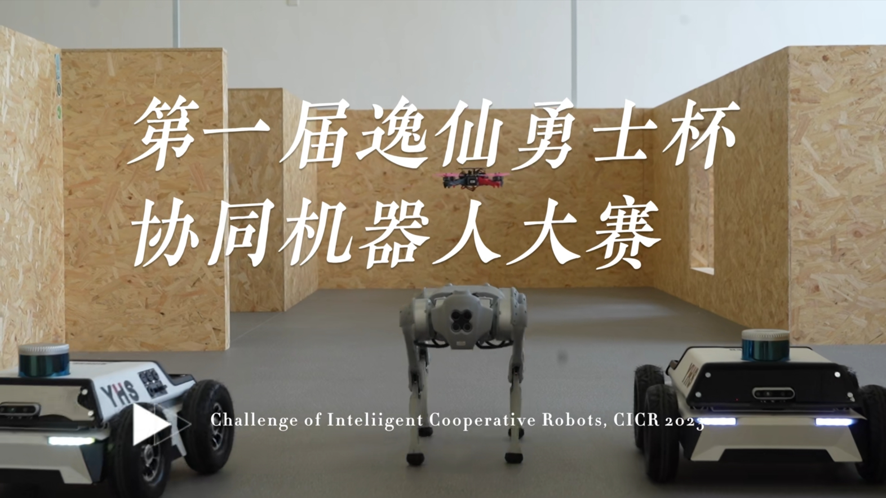
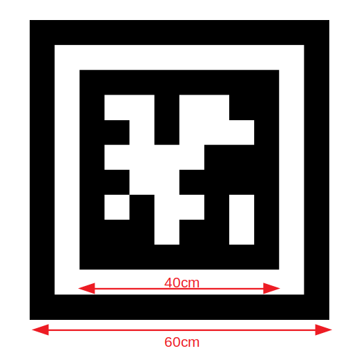

# SYSU CICR Simulator



中山大学人工智能学院承办的[第一届逸仙勇士杯协同机器人大赛](http://yxysrobot.com/)现已启动。本仓库致力于为参与**仿真赛**项目的开发者提供关键仿真环境和代码接口。

仿真赛的主要任务内容是：复杂场景中存在多个位置未知的目标二维码和随机障碍物，无人机需要实时感知环境和规划运动，尽快搜索到目标二维码并准确报告其位置坐标，发现目标越多，用时越短者获得更高的排名。比赛中，参赛队需要为无人机开发**环境感知**以及**路径规划**算法，控制无人机自主探索未知环境，寻找目标。

<p align="center">
  
</p>

# 目录

  [1. 安装说明 ](#1-安装说明)

  [2. 运行仿真](#2-运行仿真)

  [3. 技术细节说明](#3-技术细节说明)

  [4. 代码提交规范](#4-代码提交规范)

  [5. 已知问题](#5-已知问题)

# 1. 安装说明

在开始安装依赖前，请确保当前系统已经安装了 **ROS**。如果还未安装 **ROS**，请先安装 [ROS Melodic(Ubuntu18.04)](http://wiki.ros.org/melodic/Installation/Ubuntu) 或 [ROS Noetic(Ubuntu20.04)](http://wiki.ros.org/noetic/Installation/Ubuntu)。

## 1.1 仿真器依赖安装
对于 Ubuntu18.04：
```
$ sudo apt-get install ros-melodic-mavlink python-wstool python-catkin-tools protobuf-compiler libgoogle-glog-dev ros-melodic-mavros ros-melodic-mav-msgs python-pygame
```
对于 Ubuntu20.04：
```
$ sudo apt-get install ros-noetic-mavlink python3-wstool python3-catkin-tools protobuf-compiler libgoogle-glog-dev ros-noetic-mavros python3-pygame
```
## 1.2 仿真器编译
在安装完相关依赖后，将代码克隆到一个新的工作空间中，并通过catkin_make进行编译：
```
cd ${YOUR_WORKSPACE_PATH}/src
git clone git@github.com:SYSU-STAR/CICRSIM.git
cd ../ 
catkin_make
```
## 1.3 仿真器设置
首先，为脚本添加可执行权限：
```
cd CICRSIM/
sudo chmod +x sim_env.sh start_simulation.sh
```
参赛选手根据 [sim_env.sh](/sim_env.sh) 配置仿真环境，脚本中的 ```YOUR_WORKSPACE_PATH``` 请自行替换为自己的工作空间名称。例如，对一个路径为 ```~/zhangsan_workspace``` 的工作空间来说，先将 [sim_env.sh](/sim_env.sh) 中的内容替换为如下所示的内容：
```
#!/bin/bash
sudo unzip ./models.zip -d ~/.gazebo
sudo cp -r ./apriltag ~/.gazebo/models/apriltag
sudo cp -r ./files ~/zhangsan_workspace
sudo cp -r ./start_simulation.sh ~/zhangsan_workspace
```
接着，在终端中输入如下命令：
```
cd CICRSIM/
./sim_env.sh
```

以上为仿真器的相关依赖安装和环境配置，接下来说明如何使用官方提供的仿真器。

# 2. 运行仿真

## 2.1 仿真界面展示
启动仿真前，请确保启动脚本 [start_simulation.sh](/start_simulation.sh) 的位置在工作空间目录下，例如 ```/home/zhangsan/zhangsan_workspace```。

```
./start_simulation.sh
```
在脚本加载完成后，参赛者将会看见如下仿真界面：


## 2.2 启动脚本功能说明
|文件名称|功能描述|
|:-|:-|
|[keyboard_control.py](/cicr2023_simulator/uav_simulation/src/keyboard_control.py)|键盘控制无人机节点|
|[command_process.py](/cicr2023_simulator/uav_simulation/src/command_process.py)|控制器话题接收端|
|[env_simulation.launch](/cicr2023_simulator/uav_simulation/launch/env_simulation.launch)|加载仿真环境，并刷新随机障碍物和二维码|
|[uav_simulation.launch](/cicr2023_simulator//uav_simulation/launch/uav_simulation.launch)|加载仿真无人机|
|[referee_system.launch](/cicr2023_simulator/uav_simulation/launch/referee_system.launch)|裁判系统|

**注意**：参赛选手不允许修改启动脚本中的官方文件

# 3. 技术细节说明

## 3.1 相关话题说明
仿真无人机上默认搭载了一个深度相机和一个激光雷达，参赛选手可获取相机、雷达的相关话题以及无人机的里程计、IMU等话题，具体说明如下：
### 3.1.1 传感器话题
|名称|类型|描述|
|:-|:-|:-|
|`/ardrone/ground_truth/odometry`|`nav_msgs/Odometry`|里程计数据，包括无人机的位置、姿态和速度信息|
|`/ardrone/ground_truth/imu`|`sensor_msgs/Imu`|IMU传感器数据，包括无人机的姿态、速度和加速度信息，由IMU收集|
|`/camera/color/camera_info`|`sensor_msgs/CameraInfo`|RGB相机内参信息|
|`/camera/color/image_raw`|`sensor_msgs/Image`|RGB彩色图像数据，从深度相机中获取|
|`/camera/depth/camera_info`|`sensor_msgs/CameraInfo`|深度相机信息|
|`/camera/depth/image_raw`|`sensor_msgs/Image`|深度图像数据|
|`/velodyne_points`|`sensor_msgs/PointCloud2`|雷达点云数据|

参赛选手可任意使用仿真相机或仿真激光雷达对环境进行感知，但不能更改除了安装位置以外的任何参数。比赛仅允许无人机携带**1个**相机和**1个**雷达，参赛选手不允许增加额外的传感器。

### 3.1.2 其他接口话题
|名称|类型|描述|
|:-|:-|:-|
|`/position_control`|`nav_msgs/Odometry`|官方控制接口，可发布无人机的位置、姿态、速度信息来控制无人机|
|`/start_flag`|`std_msgs/Bool`|裁判系统触发接口，发布对应的消息以开始计时与计算选手当前得分|
|`/apriltag_detection`|`referee_msgs/Apriltag_info`|裁判系统二维码坐标接收接口|
## 3.2 传感器话题获取
下面给出一段示例代码，说明如何获取相机的深度数据：
```
#include <ros/ros.h>
#include <sensor_msgs/Image.h>
 void depthImageCallback(const sensor_msgs::Image::ConstPtr& msg)
{
    // 处理深度图像消息
}
 int main(int argc, char** argv)
{
    ros::init(argc, argv, "depth_image_subscriber");
    ros::NodeHandle nh;
    ros::Subscriber sub = nh.subscribe<sensor_msgs::Image>("/camera/depth/image_raw", 1, depthImageCallback);
    ros::spin();
}
```

## 3.3 无人机控制接口
参赛选手应根据官方预留的控制接口发布相关话题来开发自己的无人机控制器，具体实现如下：
```
话题名称：/position_control
数据类型：nav_msgs/Odometry
发布示例：model_odom_pub = rospy.Publisher('/position_control',Odometry,queue_size=10)
```
可分别控制无人机的位置、姿态、线速度和角速度，示例如下：
```
odom.pose.pose.position.x = 1.0
odom.pose.pose.position.y = 1.0
odom.pose.pose.position.z = 1.0

odom.pose.pose.orientation.w = 1.0
odom.pose.pose.orientation.x = 0.0
odom.pose.pose.orientation.y = 0.0
odom.pose.pose.orientation.z = 0.0

odom.twist.twist.linear.x = 1.0
odom.twist.twist.linear.y = 1.0
odom.twist.twist.linear.z = 1.0

odom.twist.twist.angular.x = 1.0
odom.twist.twist.angular.y = 1.0
odom.twist.twist.angular.z = 1.0

model_odom_pub.publish(odom)
```
**提示：** 可参考 [keyboard_control.py](/cicr2023_simulator/uav_simulation/src/keyboard_control.py) 中控制无人机的方法进行实现

## 3.4 二维码
### 3.4.1 二维码细节说明
本次比赛所采用的二维码为 **tag36h11** 系列的二维码，其尺寸大小如下图所示：

<p align="center">
  
</p>

**注意**：二维码的有效坐标为二维码的**中心**位置坐标

### 3.4.2 二维码发布示例
下面给出一段示例代码，说明如何发布二维码坐标：
```
#include <ros/ros.h>
#include <referee_msgs/Apriltag_info.h>
ros::Publisher tag_pub;
void tagPub()
{
    referee_msgs::Apriltag_info msg;
    msg.tag_num = 0;
    msg.tag_pos_x = 5.05;
    msg.tag_pos_y = 1.85;
    msg.tag_pos_z = 1.2;
    tag_pub.publish(msg);
}
int main(int argc, char** argv)
{
    ros::init(argc, argv, "tag_Publish");
    ros::NodeHandle nh;
    tag_pub = nh.advertise<referee_msgs::Apriltag_info>("/apriltag_detection",10);
    tagPub();
}
```
这段代码发布了 **0** 号二维码的坐标，请各位参赛选手参照这段示例代码进行二维码消息发布

### 3.4.3 二维码位置获取说明
在本次比赛中，**禁止**参赛选手通过服务通信方式调用gazebo的话题接口直接获取二维码的位置真值，参赛选手需要通过无人机携带的传感器对场景中的二维码位置进行检测。官方将会对参赛选手提交的代码进行检查，如果发现存在上述或其他直接获取二维码位置的行为，将视为**作弊**，严重者取消参赛资格。

## 3.5 裁判系统
比赛开始前，参赛选手的无人机应该在起飞区上方悬停。参赛选手需要先启动官方裁判系统，在裁判系统启动后，参赛选手的无人机才能开始自主探索。裁判系统的启动方式为参赛选手根据裁判系统触发接口发布对应的话题作为启动信号，具体实现示例如下：
```
#include <ros/ros.h>
#include <std_msgs/Bool.h>
ros::Publisher start_flag_pub;
void startflagPub()
{
    std_msgs::Bool my_start_flag;
    my_start_flag.data = true;
    start_flag_pub.publish(my_start_flag);
}
int main(int argc, char** argv)
{
  ros::init(argc, argv, "detect_sim");
  ros::NodeHandle nh;
  start_flag_pub = nh.advertise<std_msgs::Bool>("/start_flag",10);
  startflagPub();
}
```

裁判系统会在终端输出比赛的当前剩余时间和得分：


在倒计时结束或接收到参赛选手发布的所有二维码坐标后，裁判系统会自动关闭，比赛结束。
 
# 4. 代码及文件提交规范
## 4.1 提交文件命名规范与功能说明
在最终提交代码时，参赛选手需要提交的文件有：

|文件名称|文件属性|功能描述|
|:-|:-|:-|
|`planner`|ros package|实现无人机自主探索的算法部分|
|`controller`|ros package|无人机控制器部分，通过官方提供的控制接口实现对无人机的控制|
|`planner_dependency`|文件夹|存放除了 `planner` 和 `controller` 以外的ros package|
|`exploration.launch`|launch文件|启动所有自主探索相关的算法|
|`video.mp4`|视频文件|记录gazebo的搜索全过程|
|`report.pdf`|说明文档|说明提交代码的逻辑结构；比赛结束后，一张包含gazebo、rviz和裁判系统终端的截图；官方核实选手代码时需要知道的注意事项等|

请各位参赛选手将 `exploration.launch` 放在 `planner` 的 `launch` 目录下，具体路径为 `planner/launch`；说明文档页数不得超过**5页**，rviz截图需要包含搜索过程的**完整路径**；在最终提交压缩包时，请将上述文件依次放入压缩包并将压缩包命名为 **队名.zip**，总大小不超过**20M**。

**注意**：未按照规范提交代码及文件的参赛队伍将会被扣除一定分数，如果提交的 `exploration.launch`不能运行，则不得分。

## 4.2 官方代码核实流程
在各位参赛选手提交代码后，官方将下载本仓库的官方代码和选手提交的代码。官方代码和选手提交的代码会被放置在工作空间的 **src** 目录下，按照如下顺序进行代码测试：
```
./start_simulation.sh
source devel/setup.bash && roslaunch planner exploration.launch
```
清各位参赛选手在提交代码前按照该顺序进行代码测试。确保代码能够准确无误的运行。每位参赛选手的代码将会进行三次测试，最终的成绩取三次测试成绩的中位数。

下面给出官方测试平台的相关参数：
| CPU        | RAM     | GPU     |
| :----------------------: | :----------------------: | :----------------------: |
| i7-13700F | 32GB | RTX3060 |

# 5. 已知问题

**Q**: 随机地图无法刷新或不出现无人机

**A**: 在 [start_simulation.sh](/start_simulation.sh) 文件中先通过 [env_simulation.launch](/cicr2023_simulator/uav_simulation/launch/env_simulation.launch) 加载随机地图，再通过 [uav_simulation.launch](/cicr2023_simulator//uav_simulation/launch/uav_simulation.launch) 加载仿真无人机，请确保二者在[start_simulation.sh](/start_simulation.sh) 文件中的顺序不被改变

---
**Q**: 无人机在碰撞到场地道具后出现姿态不稳定的翻转

**A**: 将无人机降落到地面上再起飞即可恢复正常

---

**Q**: 如果遇到std成员函数导致的编译问题

**A**: 将所有CmakeLists.txt中的-std=c++11改为-std=c++17

---

**Q**: 如果遇到Gazebo打开卡住的问题

**A**: 将电脑网络断开

---

**Q**: 键盘控制节点无法运行

**A**: 请检查 [files](/files) 的位置，确保 [files](/files) 被正确放置在工作空间根目录中，例如 ```/home/zhangsan/zhangsan_workspace```

---


